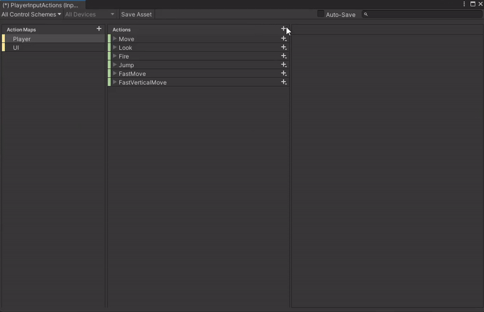

# Unity Project: Jumping and Movements Implementation

In this project, we will implement jumping and movements to a robot asset. The following steps outline the process:

1. **Download Input System Package**  
   First, we will download the Input System package from the Package Manager.  
   

2. **Restart Project with New Settings**  
   After downloading, we select "Yes" to restart the project with the new settings.  
   

3. **Add Robot Asset and Convert Render Pipeline to URP**  
   Then, we will add the robot asset using the Package Manager and convert the render pipeline to URP.  
   

4. **Add Player Input Component**  
   We then add the Player Input component to the robot asset.  
   

5. **Create Actions for Player Movement**  
   After that, we click "Create Actions" and get the premade actions for player movement.  
   

6. **Add Additional Actions to Action Map**  
   Then, we add the additional actions to the action map, making sure to select the right action type, such as axis for up and down, then adding the binding and finally checking the control scheme if it's keyboard and mouse or gamepad respectively.
     
   

8. **Add PlayerController Script**  
   Finally, we add a script to the asset called `PlayerController` to handle the movement and jumping actions.
    
   
9. **Layers**
   We make sure to set a new layer as the ground layer in Edit->Project Settings->Tags & Layers and set the terrain as the ground layer to detect for our jumping.
    
    
   
11. **GroundPoint and ShootPoint**
    
    We then add two empty objects to our player that will detect the ground and the other will be were our projectiles will shoot out of.
    
    
13. **Testing**
    
    We test the horizontal movement.
    
    
    
   The jumping.
   
   
   
   Then the vertical movement.
   
   
      
   Finally the fast horizontal and fast vertical movement.
   
   

