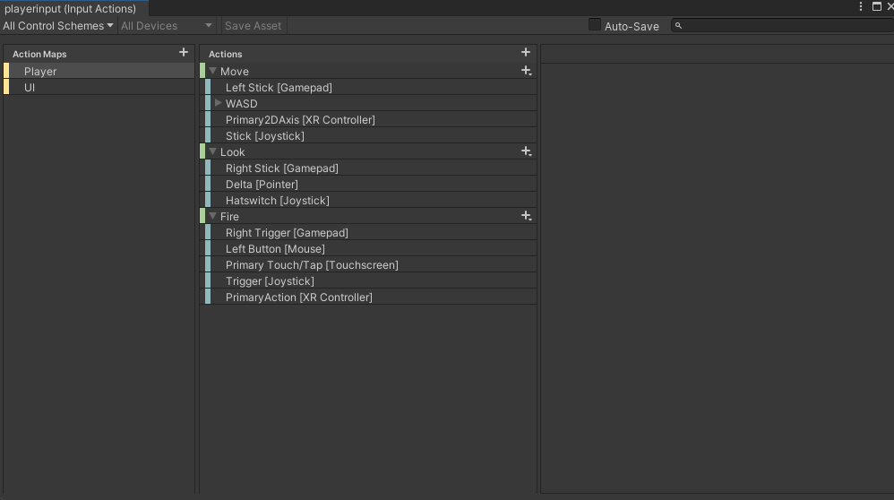

# Unity Project: Jumping and Movements Implementation

In this project, we will implement jumping and movements to a robot asset. The following steps outline the process:

1. **Download Input System Package**  
   First, we will download the Input System package from the Package Manager.  
   

2. **Restart Project with New Settings**  
   After downloading, we select "Yes" to restart the project with the new settings.  
   

3. **Add Robot Asset and Convert Render Pipeline to URP**  
   Then, we will add the robot asset using the Package Manager and convert the render pipeline to URP.  
   

4. **Add Player Input Component**  
   We then add the Player Input component to the robot asset.  
   

5. **Create Actions for Player Movement**  
   After that, we click "Create Actions" and get the premade actions for player movement.  
   

6. **Add Additional Actions to Action Map**  
   Then, we add the additional actions to the action map.  
   

7. **Add PlayerController Script**  
   Finally, we add a script to the asset called `PlayerController` to handle the movement and jumping actions.
